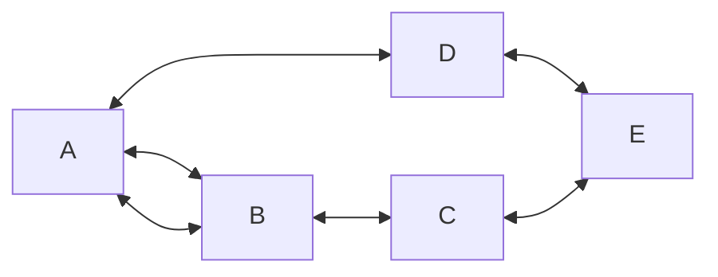

ge## Introduzione ai grafi
> [!PDF|note] [[Università/Magistrale/Complex Social Networks/Slides/1.pdf#page=184&selection=0,0,0,6&color=note|slides1, p.184]]
> > Graphs
> 
> I grafi si definiscono come la collezione di due insiemi, un insieme di vertici ed una collezione di archi definito come sottoinsieme del prodotto cartesiano tra l'insieme dei vertici e se stesso. Con $I$ insieme di vertici sarà:
> $$\begin{array} \\
I=\{A,B,C\} \\
I\times I=\{(A,B),(A,C),(B,C),(B,A),(C,A),(C,B)\}
\end{array}$$
Essendo definiti come insiemi i vertici e gli archi non possono essere duplicati. La cardinalità del prodotto cartesiano è qualcosa

> [!PDF|yellow] [[Università/Magistrale/Complex Social Networks/Slides/1.pdf#page=187&selection=4,0,9,28&color=yellow|slides1, p.187]]
> > An edge is said to be incident to a vertex if the vertex is one of the endpoints of the edge
> 
> Un grafo potrebbe essere collegato a se stesso, nei grafi considerati "Plain graphs" questo non è consentito così come non sono consetiti archi multipli tra gli stessi due vertici. (Archi paralleli)


> [!PDF|red] [[Università/Magistrale/Complex Social Networks/Slides/1.pdf#page=189&selection=6,0,6,4&color=red|slides1, p.189]]
> > path
> Un percorso è una sequenza di archi-vertici tale che ogni arco sia incidente al predecessore del vertice considerato ed al suo successore
> Se il vertice di inizio e di arrivo coincidono il percorso è detto **ciclo**
> Un vertice $u$ raggiunge un vertice $v$ se il grafo $G$ che li contiene contiene un percorso da $u$ a $v$, un grafo è connesso se per ogni due vertici esiste un percorso tra di loro.
> Nei grafi diretti esiste la definizione di forte connessione nella quale il percorso tra due vertici fortemente connessi è simmetrica, esistendo sia da $u$ verso $v$ che viceversa
>

> [!PDF|yellow] [[Università/Magistrale/Complex Social Networks/Slides/1.pdf#page=194&selection=4,13,4,14&color=yellow|slides1, p.194]]
> > Proposition 1
> 
> La somma dei gradi di tutti i vertici di un grafo è uguale a due volte il numero di archi:
> $$\sum_{v\in V}deg(v)=2m$$
> Questo perchè ciascun arco contibuisce a due volte nel conto della somma dei gradi: una volta per vertice a cui è connesso.

> [!PDF|yellow] [[Università/Magistrale/Complex Social Networks/Slides/1.pdf#page=195&selection=4,13,4,14&color=yellow|slides1, p.195]]
> > Proposition 2
> 
> In un grafo $G$ diretto con $m$ archi e un insieme di vertici $V$ sarà:
> $$\sum_{v \in V}indeg(V)=\sum_{v \in V}outdeg(V)=m$$
> Per cui la somma dei gradi in entrata dei vertici che compongono il grado è uguale alla somma dei gradi in uscita che è uguale al numero di archi.
> 
> Questo perchè in un grafo diretto un an arco contribuisce una sola volta al conteggio del grado in uscita del vertice a cui è connesso ed una volta al conteggio del grado in entrata. Per cui il contributo totale è pari al numero di archi.
> 

> [!PDF|yellow] [[Università/Magistrale/Complex Social Networks/Slides/1.pdf#page=196&selection=4,13,4,14&color=yellow|slides1, p.196]]
> > Proposition 3
> > 
> Dato un grafo **semplice** $G$ con $n$ vertici ed $m$ archi se il grafo $G$ è non diretto allora:
> $$m\leq \frac{n(n-1)}{2}$$
> Perchè ciascun arco che collega due vertici si prende una sola volta non essendo diverso $u\to v$ da $v \to u$
>Se G è diretto invece:
>$$m\leq n(n-1)$$ 


## Graphs Abstract Data type


> [!PDF|red] [[Università/Magistrale/Complex Social Networks/Slides/1.pdf#page=198&selection=0,0,0,31&color=red|slides1, p.198]]
> > Graphs Abstract Data Type (ADT)
> 
> Che tipo di funzioni e dati devono essere presenti per rappresentare il comportamento di un grafo

> [!PDF|red] [[Università/Magistrale/Complex Social Networks/Slides/1.pdf#page=202&selection=6,0,8,16&color=red|slides1, p.202]]
> > Adjacency map Adjacency matrix
> 
> Questi sono utilizzati solo per grafi piccoli

### Edge List
> [!PDF|yellow] [[Università/Magistrale/Complex Social Networks/Slides/1.pdf#page=203&selection=2,9,2,10&color=yellow|slides1, p.203]]
> > Edge List
> 
> Una Edge list è una lista di archi:

![[Università/Magistrale/Complex Social Networks/Slides/1.pdf#page=203&rect=34,44,160,128&color=yellow|slides1, p.203|250]]
```python
edgelist = [('u','v'),('v','w'),('u','w'),('w','z')]
```
Questa rappresentazione non consente di inserire un vertice singolo. Una rappresentazione alternativa consisterebbe nell'avere due liste: una lista di vertici ed una lista di archi.

Queste funzioni saranno considerate per grafi indiretti.

Spesso i grafi sono rappresentati solo come una edgelist, per cui se si volessero scaricare delle informazioni da una repository che li distribuisce rappresentati come grafi questi potrebbero presentarsi come un file di testo contenente le coppie di vertici che compongono ogni arco, la edgelist.


Data questa rappresentazione del grafo è sufficiente implementare le funzioni minime necessarie:
![[Università/Magistrale/Complex Social Networks/Slides/1.pdf#page=205&rect=17,16,282,217&color=yellow|slides1, p.205|300]]
#### Funzione vertices(graph)
```python
def vertices(graph):
	result = set() # definiamo un insieme vuoto
	for edge in graph:
		result.add(edge[0])
		result.add(edge[1])
	return list(result)
```
Questa funzione ritorna tutti i vertici, in quanto è necessario escludere i duplicati quando si estraggono dalla lista è ottima la struttura set per questo scopo. Infine castiamo l'insieme in una lista.
Questa funzione ha complessità computazionale $O(m)$ in quanto la funzione itera per ogni arco.
#### Funzione vertex_count(graph)
```python
def vertex_count(graph):
	return len(vertices(graph))
```
Banalmente contiamo il numero di elementi presenti nella lista ritornata da vertices()

#### Funzione edges(graph)
```python
def edges(graph):
	return graph

```
Basta ritornare la edgelist che rappresenta il grafo stessa.
#### Funzione edge_count(graph)
```python
def edges(graph):
$	return len(graph)

```
Basta ritornare la lunghezza della edgelist.
#### Funzione get_edge()
```python
def get_edge(graph,u,v):
	if (u,v) in graph or (v,u) in graph:
		return True
	else 
		return False
```
Ritorna vero o falso se esiste l'arco considerato dati i vertici desiderati. Il costo computazionale di questa funzione è $O(m)$ in quanto iteriamo sulla lista di archi facendo `if ... in ...` . 
#### Funzione incident_edges()
```python
def incident_edges(graph,u):
	result = []
	for edge in graph:
		if u in edge:
			result.append(edge)
		return result
```

Dato un vertice vogliamo il sottoinsieme di archi incidenti per quel vertice. La complessità computazionale è $O(2m)$

#### Funzione remove_vertex()
```python
def remove_vertex(graph,u):
	indices = []
	for i in range(len(graph)):
		if u in graph[i]:
			indices.append(i)
	for x in indices:
		graph.remove(graph[x])
	return graph
```
Dato un vertice la funzione rimuove il vertice, dunque anche tutti gli che lo comprendono.
La complessità computazionale è $O(m)$ in quanto si itera nel caso peggiore per tutti i gli archi.
#### Funzione insert_edge()
```python
def insert_Edge(graph,edge):
	u,v = edge
	if u not in vertices(graph) or v not in vertices(graph)
		print("non esistono sti vertici fra")
		return graph
	if (u,v) in graph or (v,u)
		print("esiste già l'arco bro")
		return graph
	graph.append(edge)
	return graph
```
Data una tupla "edge" la inserisce nella edgelist se esistono i vertici relativi a quest'arco e se l'arco non esiste già. 
Non considerando i check con gli if ... in la complessià è $O(1)$ in quanto viene fatto solo l'append
#### Funzione remove_edge()

```python
def remove_edge(graph,edge):
	u,v = edge 
	if (u,v) in graph:
		graph.remove((u,v))
	if (v,u) in graph:
		graph.remove((v,u))
	return graph
```
Dato un arco lo rimuove dalla edgelist, essendo un grafo indiretto verifica sia l'arco nella direzione data che quello opposto.
La complessità di questo è $O(m)$ perché al peggio si itera su tutti gli archi.
#### funzione degree()
```python
def degree(graph,vertex):
	return len(incident_edges(graph,vertex))
```
Sfruttando la funzione incident_edges che ritorna una lista di tutti gli archi che contengono il vertice preso in considerazione contando gli elementi di questa lista si ottiene il grado del vertice.
Essendo la complessità computazionale di len() $O(1)$ la complessità dipende dalla complessità di incident_edges(), per cui la complessità è $O(m)$.
#### funzione degrees()
```python
def degree(graph):
	result = {}
	for node in vertices(graph):
		result[node] = degree(graph,node)
	return result
```
Funzione che ritorna i gradi di ogni nodo del grafo sotto forma di dizionario che mappa ad ogni vertice il suo grado.
In questo caso la complessità è $O(n*m)$ in quanto per ogni vertice si itera per ogni arco (la funzione degree itera per ogni arco).
#### Lettura grafo()
immaginando di avere una edgelist sottoforma di file .txt sarà possibile caricarla tramite: 
```python
fh = open('edgelist.txt)
edges = fh.readlines() #nel caso in cui in ogni riga del file ci sia rappresentato un arco
result = []
for line in edges:
	x=line.strip(\n) # rimuove il carattere newline
	y,z = x.split() # separa i due valori e li salva in y e z, ma sono ancora stringhe
	result.append((int(y),int(z))) # bisogna castare.
```

#### Ragionamenti sulle complessità

Si osserva che si hanno complessità di $O(n)$, di $O(n\cdot m)$ 
Si osserva che essendo il numero di archi $m=\frac{n(n-1)}{2}$ sarà
$$O(n\cdot m)\simeq O(n^3)$$
#### Vantaggi e svantaggi edgelist
![[Università/Magistrale/Complex Social Networks/Slides/1.pdf#page=206&rect=20,11,343,220|slides1, p.206|400]]
### Adjacency List 
![[Università/Magistrale/Complex Social Networks/Slides/1.pdf#page=212&rect=12,75,324,221|slides1, p.212]]
Le adjacency list sono una struttura dati alternativa utilizzata per rappresentare i grafi.
La sua semplicità di implementazione dipende dalle strutture di base fornite dal linguaggio di programmazione, richiedendo array associativi per essere implementate.

Si basa sul  riempire un dizionario con chiavi i vertici e valori corrispondenti delle strutture dati che siano liste o tuple, contenenti tutti i vertici adiacenti ( i vertici che hanno un collegamento diretto con quello preso in considerazione) .

Le adjacency list portano con loro della ridondanza ripetendo le stesse relazioni nelle liste di adiacenza di ciascun vertice.

Questa ridondanza aumenta considerevolmente lo spazio in memoria richiesto, raddoppiandolo nel caso di grafi indiretti (ciascun arco è rappresentato due volte).
Tuttavia sono molto efficaci nel caso di grafi diretti e si contraddistingue per la semplicità di implementazione.

```python
adjacency_list = {1: [2,5], 2: [1,3,4,5], 3: [2,4], 4: [2,3,5], 5: [1,2]}
```

#### Funzione vertices()
```python
def vertices(graph):
	return list(graph.keys())
```
Per ritornare la lista di vertici basta ritornare le chiavi di graph, essendo queste rappresentazioni dei vertici.

#### Funzione vertex_count()
```python
def vertices(graph):
	return len(vertices())
```
Per ritornare il numero di vertici basta ritornare la lunghezza della lista di vertici.
#### Funzione edges()
```python
def edges(graph):
	result = []
	for node in graph:
		for adj in graph[node]:
			if (node,adj) not in result and (adj,node) not in result: # la funzione prenderebbe i duplicati
				result.append((node,adj))
	return result
```
Itera per ogni nodo nel grafo e ci associa tutti i vertici adiacenti evitando di inserire i duplicati.
#### Funzione edge_count()
```python
def edge_count(graph):
	return len(edges(graph))
```
Basta ritornare la lunghezza della lista di archi per averne il numero.
#### Funzione get_edge()
```python
def get_edge(graph,u,v):
	if u not in vertices(graph) or v not in vertices(graph):
		print("boom")
		return false
	if v in graph[u] and u in graph[v]: #se non c'è in entrambi c'è qualche fuck up perchè non può essere essendo non diretto
		return true
	else
		return false
```
Si verifica se esiste il vertice desiderato nella lista di adiacenze del vertice considerato per verificare se esiste l'arco tra i due. Si verifica pure che esista il contrario in quanto stiamo considerando grafi indiretti.

#### Funzione degree()
```python
def degree(graph,node):
	return len(graph[node])
```
Per ritornare il grado di un vertice basta ritornare la lunghezza della lista di vertici adiacenti associati.
#### Funzione degrees()
```python
def degree(graph):
	result = {}
	for node in graph:
		result[node] = degree(graph,node)
	return result
```
Per ritornare il grado di un vertice basta ritornare la lunghezza della lista di vertici adiacenti associati.
#### Funzione incident_edges()
```python
def incident_edges(graph,node):
	result = []
	for adj in graph[node]:
		result.append((node),(adj))
	return result
```
Si spiega solo mi pare
#### Funzione insert_vertex()
```python 
def insert_vertex(graph,newnode):
	if newnode not in graph:
		graph[newnode] = []
	return graph
```
## Attraversamento grafi

Un attraversamento è un algoritmo che dato un vertice d'inizio permette di visitare tutti gli altri vertici del grafo.

Questo algoritmo può dare informazioni sul fatto che il grafo sia connesso o meno(se partendo da un vertice li visito tutti allora è connesso, se noto il numero di vertici alla fine dell'attraversamento non se ne visitano alcuni allora il grafo non è connesso).

Attraverso questi algoritmi è possibile anche sapere se sono presenti cicli.

### Depth-First Search

IL DFS È un algoritmo di attraversamento relativo ai grafi non pesati per cui ogni arco ha la stessa priorità. Dato un vertice di inizio si effettua l'esplorazione come segue:

![[Università/Magistrale/Complex Social Networks/Slides/1.pdf#page=236&rect=26,16,341,169|slides1, p.236]]
![[Università/Magistrale/Complex Social Networks/Slides/1.pdf#page=237&rect=22,13,346,218|slides1, p.237]]

Il risultato è indipendente  dal vertice di inizio a me no che non si tratti di un grafo disconesso e si scelgano vertici appartenenti a componenti disconnesse.

- L'input è un grafo $G$ ed un vertice di partenza $s$
- L'output sarà una lista di vertici raggiungibili da $u$.
![[Università/Magistrale/Complex Social Networks/Slides/1.pdf#page=242&rect=21,9,337,222|slides1, p.242]]
![[Università/Magistrale/Complex Social Networks/Slides/1.pdf#page=243&rect=33,32,342,225|slides1, p.243]]
L'esplorazione con questo metodo non ha un approccio sistematico, si continua finché si riesce e nel momento in cui non si trova una strada si torna indietro ma comunque consente di visitare tutti i vertici attraversando tutti gli archi.
![[Università/Magistrale/Complex Social Networks/Slides/1.pdf#page=244&rect=14,7,347,228|slides1, p.244]]

#### Implementazione iterativa
Immaginando di avere il grafo rappresentato come una Adjacency List:
```python
def dfs(graph,start):
	visited, stack = set(), [start]
	while stack:
		vertex = stack.pop() #IL CONCETTO CHIAVE DICE!! SI POPPA FUORI L'ULTIMO VERTICE AGGIUNTO ALLO STACK quindi so continua ad esplorare a partire da questo, significa che si tende a preferire esplorare nuovi vertici piuttosoto che a tornare indietro finchè non si trova un vicolo cieco.
		if vertex not in visited:
			visited.add(vertex)
			stack.extend(set(graph[vertex]) - visited) # si aggiungono i vertici allo stack dato dalla differenza dei vicini del vertice che stiamo considerando meno quelli visitati, così da aggiungere alla lista di nodi da visitare tutti i nodi adiacenti
			print("Trovato vertice",vertex,"connesso a",graph[vertex])
	return visited
```
Il costo computazionale di questo algoritmo è $O(m+n)$

### Breadth-First-Search
Dato un grafo con un numero sconosciuto di vertici e vertici, il DFS potrebbe non essere il modo più efficace per la visita, essendo una visita casuale. lungo i percorsi che trova.

Il BFS è un approccio più sistematico che si basa sulla visita del grafo visitando prima i vicini del nodo preso in considerazione prima di muoversi ai prossimi nodi.

![[Università/Magistrale/Complex Social Networks/Slides/1.pdf#page=268&rect=30,9,336,221|slides1, p.268]]
Dal nodo $A$ , lo si segna come visitato e si estraggono i suoi vicini:
![[Università/Magistrale/Complex Social Networks/Slides/1.pdf#page=270&rect=35,64,338,221|slides1, p.270]]Dopodichè lo stesso si fa per $B$, F e d $E$, per poi muoversi ai vicini di $B$
![[Università/Magistrale/Complex Social Networks/Slides/1.pdf#page=271&rect=34,60,342,213|slides1, p.271]]
E così via.
![[Università/Magistrale/Complex Social Networks/Slides/1.pdf#page=272&rect=23,65,323,213|slides1, p.272]]

#### Implementazione iterativa
Immaginando di avere il grafo rappresentato come una Adjacency List:
```python
def bfs(graph,start):
	visited,queue=set(),start[]
	while queue:
		vertex=queue.pop(0)
		if vertex not in visited:
			visited.add(vertex)
			queue.extend(set(graph[vertex] - visited))
		print("Trovato nodo",vertex,"connesso a",graph[veretx])
	return visited
		
```

Il costo computazionale della $BFS$ è $O(n+m)$
## Percorsi più brevi

Il BFS è ottimale in quanto può essere utilizzato per trovare il percorso più breve partendo da un vertice $v$ verso ogni altro vertice in un nodo connesso in quanto permette di valutare la distanza di un nodo di partenza da tutti gli altri nodi tuttavia nel caso di grafi pesati non diventa più utile.

Un grafo pesato è un grafo che ha associato un valore numerico (il suo peso).

In un grafo pesato la distanza tra due vertici dipende dal loro peso.

![[Università/Magistrale/Complex Social Networks/Slides/1.pdf#page=301&rect=18,8,329,225|slides1, p.301]]
Un percorso può essere visto come successione di archi consecutivi (due archi sono consecutivi se hanno un vertice in comune). 
Il peso di un percorso è la somma dei pesi di tutti gli archi del percorso.
![[Università/Magistrale/Complex Social Networks/Slides/1.pdf#page=302&rect=23,119,257,183|slides1, p.302]]
In un grafo pesato il percorso più corto tra due vertici non è quello con meno vertici, ma quello con meno peso.

### Algoritmo di Dijkstra

L'algoritmo di Djijkstra è un algortimo greedy (si basa sul![[Pasted image 20251007133108.png]] trovare la migliore soluzione locale (per ciascuna iterazione) per poi espanderla sperando che sia la soluzione generale) per la ricerca del percorso più breve in grafi pesati.

![[Università/Magistrale/Complex Social Networks/Slides/1.pdf#page=303&rect=26,14,346,218|slides1, p.303]]
![[Università/Magistrale/Complex Social Networks/Slides/1.pdf#page=304&rect=30,85,343,217|slides1, p.304]]

Dati due nodi $u$ e $v$ collegati con il peso $w$, per ciascun vertice $D$ sarà:

Se $D[v]>D[u]+w$ significa che $D[u]$ + w è la distanza migliore dalla sorgente al vertice $D$.

L'algoritmo di Djijkstra appartiene alla classe di SSSP (Single source shortest path).
L'algoritmo ritorna un Minimum Spanning Tree del percorso minimo, un albero  che contiene tutti i vertici del grafo appartenenti al percorso ed un sottoinsieme degli archi che connette tutti questi vertici.
#### Implementazione ricorsiva
Immaginando di avere il grafo rappresento come una lista di adiacenza composto da un dizionario di dizionari che associa in un dizionario a ciascun vertice un dizionario di tutti i vertici adiacenti a cui sono associati i loro pesi. Esempio:
```python
graph={'A': {'B': 250,'C': 500}, 'B' : {'A':150}}
```
Una possibile implementazione ricorsiva sarà:
```python
def dijkstra(graph,src,dest,visited=[],distances={},pred={}):
	if src == dest:
		path = []
		pred = dest
		while pred != None:
			path.append(pred)
			pred=predecessors.get(pred,None)
		path.reverse()
	else:
		if not visited:
			distances[src]=0
		for neighbor in graph{src}:
			if neighbor not in visited:
				new_distance = distances[src] + graph[src][neighbor]
				if new_distance < distances.get(neighbor,float('inf)):
					distances[neighbor] = new_distance
					pred[neighbor] = src
			visited.append(src)
			unvisited={}
			for k in graph:
				if k not in visited:
					unvisited[k] = distances.get(k,float('inf))
				x=min(unvisited,key=unvisited.get)
				dijkstra(graph,x,dest,visited,distances,pred)
```

