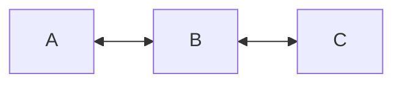
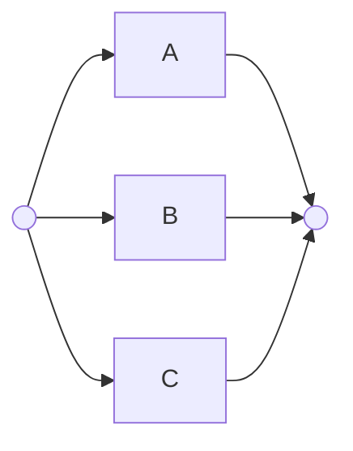
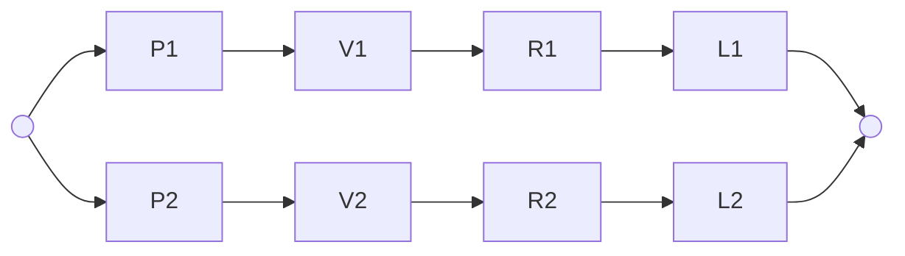
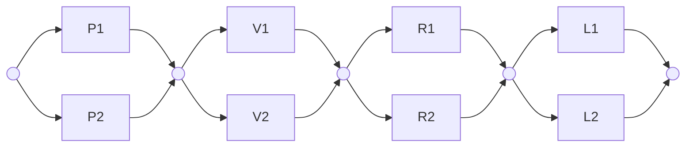

Si definiscono sistemi non riparabili sistemi la cui vita termina nel momento in cui avviene un guasto, questi sistemi sono caratterizzati dall'affidabilità.

Si definiscono sistemi complessi sistemi dove molti sotto-sistemi interagiscono tra di loro per raggiungere un obiettivo.  Si vuole ottenere un informazione[[6 Affidabilità#Reliability| sull'affidabilità]] del sistema complesso data la conoscenza dell'affidabilità dei sistemi che lo compongono.
## Sistemi in serie



In un sistema in cui le sue componenti sono collegate in serie, **il fallimento di un componente comporta il fallimento dell'intero sistema**.

Considerati:
- $X_{s}$ tempo di vita del sistema.
- $X_{i}$ tempo di fallimento dell'$i-$esimo blocco.

Il sistema funzionerà solo se tutti i sottosistemi funzionano, per cui l'affidabilità sarà:
$$R_{s}(t)=P[X_{s}>t]=P[X_{1}>t,X_{2}>t,\dots,X_{n}>t]$$
Considerate indipendenti le [[3 Variabili Aleatorie e distribuzioni di probabilità#variabili aleatorie|variabili aleatorie]] tempo di vita di ciascun componente sarà possibile considerare questa probabilità dell'intersezione degli eventi come [[1 Introduzione alla teoria delle Probabilità#^i95zzm|il prodotto delle probabilità dei singoli eventi]] per cui:
$$R_{s}(t)=P[X_{1}>t]\cdot P[X_{2}>t]\cdot\dots \cdot P[X_{n}>t]=\Pi_{i=1}^nR_{i}(t)$$
**Per cui l'affidabilità di un sistema in serie è pari al prodotto delle affidabilità delle sue componenti.**

> [!caution] Osservazione
> Essendo l'affidabilità una probabilità, dunque un numero tra $0$ ed $1$, il prodotto tra valori compresi in questo intervallo è sempre minore al valore più piccolo, **dunque l'affidabilità di un sistema in serie è inferiore a quella del suo componente più inaffidabile**

> [!danger] Importante
> Essendo l'affidabilità del sistema un prodotto, se i componenti hanno un andamento esponenziale dell'affidabilità, anche il sistema avrà un affidabilità esponenziale con parametro $\lambda$ somma dei $\lambda_{i}$ relativo a ciascuna componente.

### Miglioramento dell'affidabilità

Immaginando che un componente di un sistema in serie incrementi la sua affidabilità di una quantità $\Delta R_{i}$ anche l'affidabilità del sistema migliorerà di un certo $\Delta R_{s}$ esprimibile come:
$$\Delta R_{s}=\frac{R_{s}(t)}{R_{i}(t)}\cdot\Delta R_{i}$$

> [!dimostrazione]- Dimostrazione
> Considerata l'affidabilità del sistema incrementata:
> $$R_{s}(t)+\Delta R_{s}=R_{1}(t)\cdot R_{2}(t)\cdot...\cdot(R_{i}(t)+\Delta R_{i})\cdot. ..\cdot R_{n}(t)$$
> Sviluppando il prodotto:
> $$R_{1}(t)\cdot R_{2}(t)\cdot...\cdot R_{i}(t)\cdot...\cdot R_{n}(t)+R_{1}(t)\cdot R_{2}(t)\cdot...\cdot \Delta R_{i}(t)\cdot...\cdot R_{n}(t)$$
> Moltiplicando e dividendo per $R_{i}(t)$:
> $$R_{1}(t)\cdot R_{2}(t)\cdot...\cdot R_{i}(t)\cdot...\cdot R_{n}(t)+R_{1}(t)\cdot R_{2}(t)\cdot...\cdot \Delta R_{i}(t)\cdot...\cdot R_{n}(t)\cdot \frac{R_{i}}{R_{i}}$$
> Questa espressione ha come primo addendo proprio $R_{s}(t)$ e come secondo $\frac{R_{s}\cdot\Delta R_{i}}{R_{i}(t)}$
> Per cui sarà:
> $$R_{s}(t)+\Delta R_{s}=R_{s}(t)+\frac{R_{s}\cdot\Delta R_{i}}{R_{i}(t)}$$
> Da cui:
> $$\Delta R_{s}=\frac{R_{s}(t)}{R_{i}(t)}\cdot\Delta R_{i}$$

Per cui la variazione dell'affidabilità del sistema in rapporto con l'affidabilità di una singola componente:
$$\frac{\Delta R_{s}}{\Delta R_{i}}=\frac{R_{s}(t)}{R_{i}(t)}\cdot$$
**Per cui l'incremento dell'affidabilità del sistema è più alta minore è l'affidabilità del componente la cui affidabilità si migliora.**

## Sistemi ridondanti



Un sistema ridondante è un sistema in cui il guasto di una componente elementare non comporta il fallimento dell'intero sistema. In questi sistemi le componenti sono disposte in parallelo.

Considerati:
- $X_{s}$ tempo di vita del sistema.
- $X_{i}$ tempo di fallimento dell'$i-$esimo blocco.
- La CDF di $X_{s}$ ovvero $F_{s}$ inaffidabilità del sistema.
- La CDF di $X_{i}$ ovvero $F_{i}$ inaffidabilità dell'$i$-esima componente. 

Il sistema funzionerà solo se almeno uno dei componenti è ancora  funzionante, per cui l'affidabilità sarà:
$$F_{s}(t)=P[X_{s}<t]=P[X_{1}\leq t,X_{2}\leq t,\dots,X_{n}\leq t]$$
Per cui, considerati i componenti statisticamente indipendenti, sarà:
$$F_{s}(t)=P[X_{1}\leq t]\cdot P[X_{2}\leq t]\cdot\dots \cdot P[X_{n}\leq t]=\Pi_{i=1}^nF_{i}(t)$$
Dalla [[6 Affidabilità#Reliability|definizione di affidabilità]] essendo $F_{i}=1-R_{i}$ sarà:
$$F_{s}(t)=1-R_{s}=(\Pi_{i=1}^n 1-R_{i}(t))$$ Da cui sarà:
$$R_{s}(t)=1-(\Pi_{i=1}^n1-R_{i}(t))$$

> [!caution] Osservazione
> Si osserva che per due sole componenti l'affidabilità diventa:
> $$R_{s}(t)=1-\Pi_{i=1}^21-R_{i}(t)=R_{1}(t)+R_{2}(t)-R_{1}(t)R_{2}(t)$$

> [!danger] Importante
> Data l'espressione dell'affidabilità dei sistemi ridondanti, se i singoli componenti hanno affidabilità con andamento esponenziale il sistema avrà un andamento **esponomiale**, una combinazione lineare di funzioni esponenziali.


###  Miglioramento dell'affidabilità

Immaginando che un componente di un sistema in parallelo incrementi la sua affidabilità di una quantità $\Delta R_{i}$ anche l'affidabilità del sistema migliorerà di un certo $\Delta R_{s}$ esprimibile come:
$$\Delta R_{s}=\frac{1-R_{s}(t)}{1-R_{i}(t)}\cdot\Delta R_{i}$$
Per cui la variazione dell'affidabilità del sistema in rapporto con l'affidabilità di una singola componente:
$$\frac{\Delta R_{s}}{\Delta R_{i}}=\frac{1-R_{s}(t)}{1-R_{i}(t)}\cdot$$
**Per cui l'incremento dell'affidabilità del sistema è più alta maggiore è l'affidabilità del componente la cui affidabilità si migliora.**

## Sistemi serie-parallelo

È possibile che sistemi presentino architetture con componenti che ai fini dell'affidabilità risultino sia in serie tra di loro che in parallelo, così portando a configurazioni risolvibili in molti casi attraverso la riduzione delle serie e dei paralleli.
### Ridondanza del sistema


È possibile rendere l'intero sistema ridondante mettendo in parallelo la serie di componenti che lo rappresenta, **dunque creando ridondanza dell'intero sistema**.

> [!example]- Esempio
> Per un sistema con due sole componenti $A$ e $B$:
> ```mermaid
> graph LR
>   O1(( )) --> A1 --> B1 --> O2(( ))
>   O1 --> A2 --> B2 --> O2
> ```
> L'affidabilità di ciascun ramo sarà l'affidabilità della serie:$R_{serie}=R_{A}R_{B}$ 
> L'affidabilità di tutto il sistema sarà il parallelo di $R_{serie}$ con se stesso per cui:
>  $$R_{s}=2R_{A} R_{B}-(R_{A} R_B)^2=R_{A}R_{B}(2-R_{A}R_{B})$$

### Ridondanza delle componenti



È possibile rendere le singole componenti del sistema ridondanti mettendo queste in parallelo con le loro copie e mettendo in serie ciascun parallelo così ottenuto, **dunque creando ridondanza delle componenti **

> [!example]- Esempio
> Per un sistema con due sole componenti $A$ e $B$:
> ```mermaid
> graph LR
>   O1(( )) --> A1 --> N1(( ))
>   O1 --> A2 --> N1
> 
>   N1 --> B1 --> O2(( ))
>   N1 --> B2 --> O2
> 
> ```
> L'affidabilità di ciascun parallelo sarà: $R_{i_{parallelo}}=2R_{i}-R_{i}^2$ 
> L'affidabilità di tutto il sistema sarà la serie dei  $R_{parallelo}$  per cui:
> $$R_{s}=(2R_{A}-R_{A}^2)\cdot(2R_{B}-R_{B}^2)=R_{A}R_{B}[4-2(R_{A}+R_{B})+R_{A}R_{B}]$$

### Confronto tra ridondanza del sistema e ridondanza delle componenti

Immaginando di avere:
- Un sistema con **ridondanza di sistema** totale $s_{1}$ con affidabilità: $R_{s_{1}}$ 
- Un sistema con **ridondanza di componenti** totale $s_{2}$ con affidabilità $R_{s_{2}}$ 

Confrontando l'affidabilità di ciascun sistema facendone il rapporto sarà:
$$\frac{R_{s_{2}}}{R_{s_{1}}}=1+\frac{2(1-R_{A})(1-R_{B})}{2-R_{A}R_{B}}>1$$

> [!dimostrazione]- Dimostrazione
> Considerato:
> $$\frac{R_{s_{2}}}{R_{s_{1}}}=\frac{R_{A}R_{B}[4-2(R_{A}+R_{B})+R_{A}R_{B}]}{R_{A}R_{B}(2-R_{A}R_{B})}$$
> Sarà:
> $$\frac{R_{s_{2}}}{R_{s_{1}}}=\frac{2+2-2(R_{A}+R_{B})+2R_{A}R_{B}-R_{A}R_{B}}{2-R_{A}R_{B}}$$
> Sviluppando:
> $$\frac{R_{s_{2}}}{R_{s_{1}}}=\frac{2-2(R_{A}+R_{B})+2R_{A}R_{B}}{2-R_{A}R_{B}}$$
> Da cui:
> $$\frac{R_{s_{2}}}{R_{s_{1}}}=1+\frac{2(1-R_{A})(1-R_{B})}{2-R_{A}R_{B}}$$
> Essendo $R_{A}$ ed $R_{B}$ delle probabilità, assumeranno valori compresi tra $0$ ed $1$, perciò:
$$\frac{R_{s_{2}}}{R_{s_{1}}}=1+\frac{2(1-R_{A})(1-R_{B})}{2-R_{A}R_{B}}>1$$  


**Per cui essendo il rapporto $> 1$ sarà $R_{s_{2}}>R_{s_{1}}$ per cui la ridondanza delle componenti sarà più efficace rispetto alla ridondanza del sistema in termini di affidabilità. **


> [!intuito] Intuito
> La ridondanza delle componenti da maggiore affidabilità in quanto garantisce che esista sempre un percorso che attraversi il sistema, nella ridondanza di sistema invece il fallimento di una singola componente di una replica del sistema causa il guasto di tutta la replica.

> [!caution] Osservazione
> La ridondanza delle componenti per quanto sia più conveniente in termini di affidabilità è più costosa dal punto di vista architetturale.


## Strutture complesse

Sono strutture complesse strutture che non possono essere ridotte in strutture serie-parallelo. Questi sistemi possono presentare più volte lo stesso componente, **ma ciascun elemento è indipendente dagli altri.**

### Metodo euristico

È possibile ottenere un informazione relativa all'affidabilità  di questi sistemi,**considerato il comportamento di un singolo componente $C$**, attraverso un euristica basa sul [[1 Introduzione alla teoria delle Probabilità#Teorema della probabilità totale|teorema della probabilità totale]].

Considerati i seguenti eventi:

- $E_{s}$ l'evento nel quale il sistema è operativo nell'intervallo di tempo $[0,t[$
- $E_{s_{1}}$ l'evento in cui il componente  **è operativo** nell'intervallo di tempo $[0,t[$ con il sistema è operativo nell'intervallo di tempo $[0,t[$
- $E_{s_{2}}$ l'evento in cui il componente $C$ **è guasto** nell'intervallo di tempo $[0,t[$ con il sistema è operativo nell'intervallo $[0,t[$ 

> [!info] Chiarimento
> Gli eventi $E_{s_{1}}$ ed $E_{s_{2}}$ sono disgiunti in quanto non possono verificarsi simultaneamente. Questi definiscono un partizionamento dell'evento $E_{s}=E_{s_{1}}\cup E_{s_{2}}$.
>  
> **È dunque possibile  applicare il teorema della probabilità  totale perchè andremo a valutare $E_{s}$ stesso che ricade interamente all'interno dello spazio partizionato da $Es_{1}$ ed $Es_{2}$.**

Considerata la variabile aleatoria $X_{c}$ (tempo vita del componente $C$) ed essendo $R_{s}(t)$ coincidente con $E_{s}$, valutando questa stessa probabilità attraverso il teorema della probabilità totale:$$R_{S}(t)=P[E_{S_{1}}]+P[E_{s_{2}}]=P[X_{C}>t]P[X_{S}>t|X_{C}>t]+P[X_{C}\leq t]P[X_{S}>t|X_{C}\leq t]$$Da cui, esprimendo tutto in termini di affidabilità sarà:
$$R_s(t)=R_{C}(t)R_{S}(t|X_{C}>t)+(1-R_{C}(t))R_{S}(t|X_{C}\leq t)$$

> [!check] Nota pratica
La scelta del componente $C$ non è casuale: conviene scegliere $C$ in modo che la sua rottura suddivida il sistema in sottosistemi collegati in **serie o in parallelo**, rendendo così più agevole il calcolo delle probabilità condizionate.


*esempio struttura a ponte*

*altri tipi di ridondanzza*: standby redundancy  e k out of n system